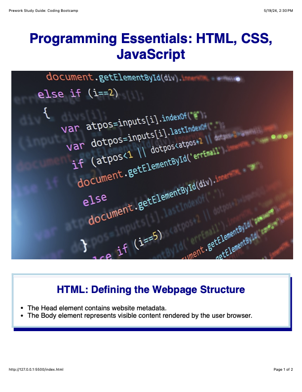

# Columbia University Full-Stack Developer Bootcamp - Notes Website Project

## Description

The Notes Website Project serves as an educational vehicle, introducing core programming concepts and tools, and mnemonic tool, providing an accessible, central location for recording and maintaining notes on core programming languages and processes introduced by the Bootcamp.

The Notes Website Project addresses the need to both record new information regarding Full-Stack Development, and exercise introduced programming skills which is done through creation and maintenance of the Notes Website itself.

The Notes Website Project provides an overview of key Full-Stack Development programming languages, including,

- HTML
- CSS
- JavaScript

The Project also introduces key programming process tools, including,

- Git
- GitHub

## Table of Contents (Optional)

N / A

## Installation

N / A

## Usage

The Notes Website permits Bootcamp participants to record information specific to particular web technologies, including HTML, CSS and JavaScrip, in sections dedicated to each.

Through the use of the DevTools console, active JavaScript code can be viewed, and trialed, providing dynamic interaction with that coding language.

## Credits

N / A

## License

Copyright <YEAR> <COPYRIGHT Chris Milazzo>

Permission is hereby granted, free of charge, to any person obtaining a copy of this software and associated documentation files (the “Software”), to deal in the Software without restriction, including without limitation the rights to use, copy, modify, merge, publish, distribute, sublicense, and/or sell copies of the Software, and to permit persons to whom the Software is furnished to do so, subject to the following conditions:

The above copyright notice and this permission notice shall be included in all copies or substantial portions of the Software.

THE SOFTWARE IS PROVIDED “AS IS”, WITHOUT WARRANTY OF ANY KIND, EXPRESS OR IMPLIED, INCLUDING BUT NOT LIMITED TO THE WARRANTIES OF MERCHANTABILITY, FITNESS FOR A PARTICULAR PURPOSE AND NONINFRINGEMENT. IN NO EVENT SHALL THE AUTHORS OR COPYRIGHT HOLDERS BE LIABLE FOR ANY CLAIM, DAMAGES OR OTHER LIABILITY, WHETHER IN AN ACTION OF CONTRACT, TORT OR OTHERWISE, ARISING FROM, OUT OF OR IN CONNECTION WITH THE SOFTWARE OR THE USE OR OTHER DEALINGS IN THE SOFTWARE.

## Badges

N / A

## Features

N / A

## How to Contribute

N / A

## Tests

N / A